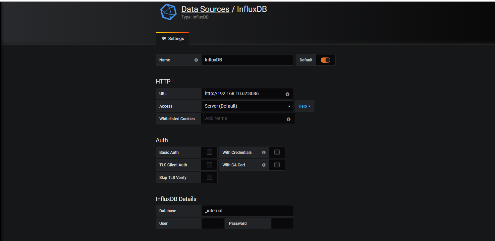
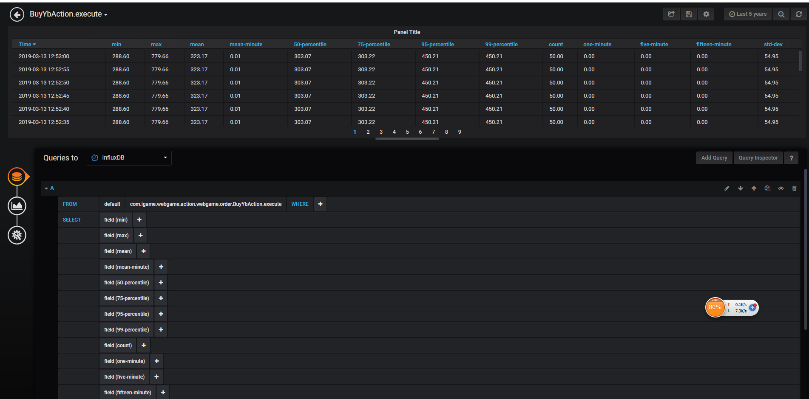

* content
{:toc}

## 系统监控痛点
很多时候，我们的应用开发出来了，团队不大，没有专门的人做系统监控，然后在线上跑着，我们根本就不知道应用跑的如何，上线了以后对自己来说，就是一个黑盒。
只要系统没宕机，一切都是很美好的。等宕机了，就已经来不及了。我们需要一个监控系统，来监控系统的状态，包括磁盘，cpu,内存使用率，流量等等。

目前我们的系统就遇到了这样的情况，基本上是黑盒运行。虽有阿里云的警报（磁盘使用率，cpu使用率，流量报警等），但是我们还是希望有一个更具体的系统能够监控我们想要的指标的展示。
譬如系统的tps。在必要的时候我们能够去扩展监控我们关心的指标。

### 可选方案
对于这个监控组件，有很多实现。ganglia,nagios,zabbix,metric,javamelody等。作为一个架构师，我们要做的是对这些可选的组件做出抉择，
- 是否适合我们的需求
- 运维成本

我们的需求是什么呢？因为团队很小，没有运维，我们就2个人，只希望能在应用上线的时候看到这些指标，不用去运维某个其他的项目。
而以上ganglia,nagios,zabbix这些组件都是独立的，并不是很合适。不过如果没有其他合适的方案，也只能备选了。
所以我们先看看metric,javamelody

###  metric
首先我们需要定义监控数据的产生，然后我们需要定义监控数据收集的规则，再后则是数据监控数据的展现形式，最后则是根据监控数据进行报警.
metric的原理就是在应用程序中埋点，和程序有耦合，然后收到这些数据后，能够通过很多方式上报到第三方组件中 或者 通过http请求查看。
这是metric的官方文档地址[地址](https://metrics.dropwizard.io/3.1.0/getting-started/#)


这是我写的一个spring5的[demo](https://github.com/lizanle521/metricexample)，用来统计接口的tps。

如果要和spring3等配合的话，有几个比较关键的地方：
首先引入maven
```text
 <dependency>
            <groupId>io.dropwizard.metrics</groupId>
            <artifactId>metrics-core</artifactId>
            <version>3.1.0</version>
        </dependency>
        <dependency>
            <groupId>io.dropwizard.metrics</groupId>
            <artifactId>metrics-servlets</artifactId>
            <version>3.1.0</version>
        </dependency>
        <dependency>
            <groupId>com.ryantenney.metrics</groupId>
            <artifactId>metrics-spring</artifactId>
            <version>3.1.3</version>
        </dependency>
```

1. 定义一个类实现 MetricServlet.ContextListener，这是为了给ServletContext注入MetricRegistry

```text
public class MetricsServletContextListener extends MetricsServlet.ContextListener {

    public static final MetricRegistry METRIC_REGISTRY = new MetricRegistry();

    @Override
    protected MetricRegistry getMetricRegistry() {
        return METRIC_REGISTRY;
    }
}
```

2. web.xml配置监听器

```text
<listener>
		<listener-class>com.igame.webgame.listener.MetricsServletContextListener</listener-class>
</listener>

	<servlet>
		<servlet-name>adminServlet</servlet-name>
		<servlet-class>com.codahale.metrics.servlets.MetricsServlet</servlet-class>
	</servlet>
	<servlet-mapping>
		<servlet-name>adminServlet</servlet-name>
		<url-pattern>/metrics/*</url-pattern>
	</servlet-mapping>
```

3. 自定义拦截器,统计每个接口的tps

```text
public class MetricIntercetor implements HandlerInterceptor,ApplicationContextAware {
    private ApplicationContext applicationContext;

    @Override
    public void setApplicationContext(ApplicationContext applicationContext) throws BeansException {
        this.applicationContext = applicationContext;
    }

    private final static ThreadLocal<Timer.Context> tl = new ThreadLocal<Timer.Context>();
    @Override
    public boolean preHandle(HttpServletRequest request, HttpServletResponse response, Object handler) throws Exception {
        if(handler instanceof HandlerMethod){
            HandlerMethod handlerMethod = (HandlerMethod) handler;
            Class<?> beanType = handlerMethod.getBeanType();
            Method method = handlerMethod.getMethod();

            MetricRegistry metricRegistry = (MetricRegistry) request.getServletContext().getAttribute(MetricsServlet.METRICS_REGISTRY);
            Timer time = metricRegistry.timer(MetricRegistry.name(beanType.getName(), method.getName()));
            Timer.Context context = time.time();
            tl.set(context);
            return true;
        }else{
            return true;
        }
    }

    @Override
    public void postHandle(HttpServletRequest request, HttpServletResponse response, Object handler, ModelAndView modelAndView) throws Exception {

    }

    @Override
    public void afterCompletion(HttpServletRequest request, HttpServletResponse response, Object handler, Exception ex) throws Exception {
        Timer.Context context = null;
        if((context = tl.get()) != null){
            context.close();
        }
    }
}
```

4. 配置spring-mvc.xml 放在其他拦截器拦截之后

```text
<mvc:interceptors>
		<mvc:interceptor>
			<mvc:mapping path="/**"/>
			<bean class="xxxx.XXXIneterceptor"/>
		</mvc:interceptor>
		<mvc:interceptor>
			<mvc:mapping path="/**"/>
			<mvc:exclude-mapping path="/metrics/**"/>
			<bean class="xxx.MetricInterceptor"/>
		</mvc:interceptor>
	</mvc:interceptors>
```

5. 通过 ip:port/metrics/访问获得json结果

显然 metric存在一个缺点，就是不是分布式的。我们如果有多台机器，且负载均衡的话，那么请求一次可能是同一个结果，或者说不同的结果。
我们要对系统做整体的tps统计就达不到要求了。

那么我们如果做到分布式的收集多台机器的数据上报呢？ metric有提供 influxdb ,ganglia 等上报方式
我们先试试 influxdb的上报,用granfana展示
1. 安装influxdb

```text
wget http://dl.influxdata.com/influxdb/releases/influxdb-0.12.2-1.x86_64.rpm
yum localinstall influxdb-0.12.2-1.x86_64.rpm
```
2. 启动并查看

```text
systemctl start influxdb.service
systemctl status influxdb.service
```
启动后打开 web 管理界面 http://192.168.2.183:8083/ 默认用户名和密码是 root 和 root. InfluxDB 的 Web 管理界面端口是 8083，HTTP API 监听端口是 8086，
如果需要更改这些默认设定，修改 InfluxDB 的配置文件（/etc/influxdb/influxdb.conf）并重启就可以了。

3. 安装grafana

```text
wget https://dl.grafana.com/oss/release/grafana-6.0.1-1.x86_64.rpm 
sudo yum localinstall grafana-6.0.1-1.x86_64.rpm 
```
4. 启动并查看

```text
systemctl start grafana-server.service
systemctl status grafana-server.service
```
用浏览器访问 Grafana,默认端口是3000，默认的帐号密码都是 admin（可以在配置文件中找到），登录之后配置influxdb的数据源如图所示：


那么现在我们的展示组件安装好了，我们的要修改我们的应用程序，让他来上报数据。
1. 添加maven依赖

```text
 <dependency>
            <groupId>com.github.davidb</groupId>
            <artifactId>metrics-influxdb</artifactId>
            <version>0.9.3</version>
 </dependency>
```

2. 添加一个ApplicationListener

```text
@Component
public class ApplicationStarterListener implements ApplicationListener<ContextRefreshedEvent> {
    private final static Logger logger = LoggerFactory.getLogger(ApplicationStarterListener.class);
    private final static AtomicBoolean started = new AtomicBoolean(false);
    @Override
    public void onApplicationEvent(ContextRefreshedEvent event) {
        if(started.compareAndSet(false,true)) {
            InfluxdbProtocol protocol = new HttpInfluxdbProtocol("192.168.10.62", 8086, "_internal");
            MetricRegistry metricRegistry = null;
            ConfigurableWebApplicationContext applicationContext = (ConfigurableWebApplicationContext) event.getApplicationContext();
            ServletContext servletContext = applicationContext.getServletContext();
            metricRegistry = (MetricRegistry) servletContext.getAttribute(MetricsServlet.METRICS_REGISTRY);
            ScheduledReporter build = InfluxdbReporter.forRegistry(metricRegistry)
                    .protocol(protocol)
                    .convertRatesTo(TimeUnit.SECONDS)
                    .convertDurationsTo(TimeUnit.MILLISECONDS)
                    .filter(MetricFilter.ALL)
                    .skipIdleMetrics(false)
                    .build();
            build.start(5, TimeUnit.SECONDS);
            logger.info(" InfluxdbReporter started");
        }
    }
}
```

启动应用后，我们打开grafana,选择一个上报的接口，选择他的查询条件，如图所示：
,这样，metric+influxdb+ganfana的监控组合搭建起来了。